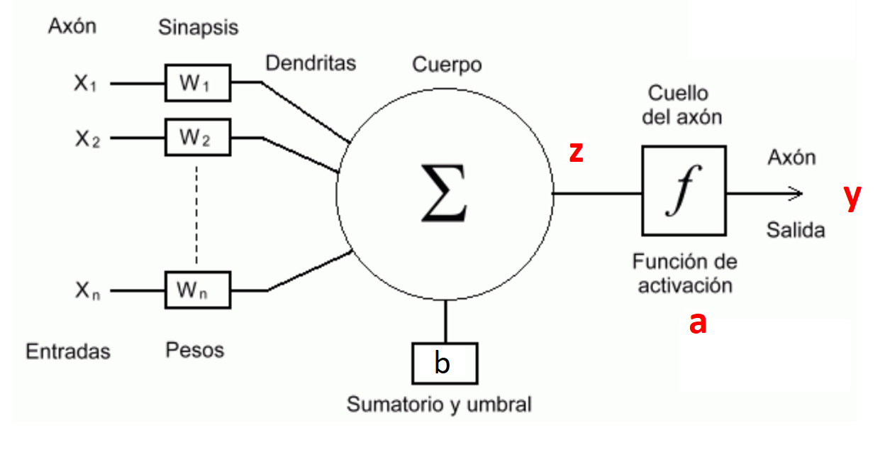

# **Lección 2: Neurona Artificial - McCulloch y Pitts (1943)**

## **1. Introducción**

En esta lección, exploraremos la primera neurona artificial propuesta por **Warren McCulloch y Walter Pitts en 1943**. Esta neurona matemática es la base de los modelos modernos de redes neuronales.

## **2. ¿Qué es una Neurona de McCulloch-Pitts?**

Es un modelo matemático inspirado en el cerebro humano que procesa señales de entrada y genera una salida basada en una función de activación.



### **Características:**

- Recibe múltiples entradas \( x_1, x_2, ..., x_n \).
- Cada entrada tiene un peso \( w_1, w_2, ..., w_n \).
- Calcula una suma ponderada de las entradas.
- Aplica una función de activación (usualmente un escalón).

## **3. Representación Matemática**

La salida de la neurona se define como:

```math
y = f\left(\sum_{i=1}^{n} w_i x_i - \theta \right)
```

Donde:

- \( y \) es la salida de la neurona.
- \( w_i \) son los pesos de las entradas.
- \( x_i \) son las entradas.
- \( \theta \) es el umbral (bias).
- \( f \) es la función de activación (escalón, sigmoide, etc.).

en este caso la función de activación es un escalón:

```math
f(x) = \begin{cases} 1 & \text{si } x \geq 0 \\ 0 & \text{si } x < 0 \end{cases}
```
otras funciones de activación comunes son:
- Sigmoide:
```math
f(x) = \frac{1}{1 + e^{-x}}
```
- ReLU:
```math
f(x) = \max(0, x)
```
- Tanh:
```math
f(x) = \frac{e^x - e^{-x}}{e^x + e^{-x}}
```
- Softmax:
```math
f(x_i) = \frac{e^{x_i}}{\sum_{j=1}^{n} e^{x_j}}
```


## **4. Tablas de Verdad**

La neurona de McCulloch-Pitts puede resolver compuertas lógicas:

| x1  | x2  | AND | OR  | NOT (x1) |
| --- | --- | --- | --- | -------- |
| 0   | 0   | 0   | 0   | 1        |
| 0   | 1   | 0   | 1   | 1        |
| 1   | 0   | 0   | 1   | 0        |
| 1   | 1   | 1   | 1   | 0        |

## **5. Implementación en TensorFlow**

Implementaremos una neurona de McCulloch-Pitts capaz de realizar operaciones lógicas como AND, OR y NOT.

**Ejemplo de Neurona AND**
el resto de las puertas lógicas se encontrarán en el archivo `example.py`

```python
import tensorflow as tf

# Inputs and weights
inputs = tf.constant([[0,0], [0,1], [1,0], [1,1]], dtype=tf.float32)
weights = tf.constant([[1.0], [1.0]], dtype=tf.float32)
threshold = tf.constant(-1.5, dtype=tf.float32)

# Compute weighted sum
weighted_sum = tf.matmul(inputs, weights) + threshold

# Apply step activation function
output = tf.where(weighted_sum >= 0, 1.0, 0.0)

print("AND Gate Output:\n", output.numpy())

```

Lo podemos visualizar como:

```math
\text{AND}(x_1, x_2) = f(w_1 x_1 + w_2 x_2 - \theta)
```
Con los pesos y el umbral definidos como:
```math
\text{AND}(x_1, x_2) = f(1 x_1 + 1 x_2 - (-1.5))
```

## **6. Conclusión**

La neurona de McCulloch y Pitts estableció las bases de las redes neuronales modernas. En la siguiente lección, exploraremos la regla de Hebb y el modelo Adaline para mejorar el aprendizaje automático.
