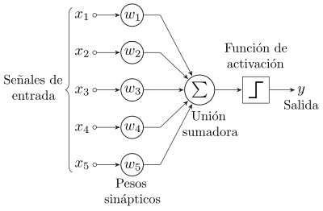
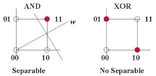

# **Lección 3: Perceptrón – Frank Rosenblatt (1959)**

## **1. Introducción**

El **Perceptrón** es uno de los primeros modelos de redes neuronales propuestos por **Frank Rosenblatt en 1959**. Se trata de una **neurona artificial** que recibe entradas, las pondera mediante pesos y produce una salida binaria basada en una función de activación.

Es la base de muchas redes neuronales modernas y se utiliza para problemas de clasificación linealmente separables, como la implementación de compuertas lógicas.

## **2. Arquitectura y Funcionamiento del Perceptrón**

Un perceptrón simple está compuesto por:  


- **Entradas \( x_1, x_2, ..., x_n \)**
- **Pesos \( w_1, w_2, ..., w_n \)**
- **Sesgo \( b \)**
- **Función de activación (umbral o función escalón)**

El cálculo de salida se define matemáticamente como:

```math
y = f\left( \sum_{i=1}^{n} w_i x_i + b \right)
```

Donde f(x)f(x) es la función escalón:

```math
f(x) = \begin{cases} 1 & \text{si } x \geq 0 \\ 0 & \text{si } x < 0 \end{cases}
```

## **3. Algoritmo de Aprendizaje y Ajuste de Pesos**

El perceptrón aprende ajustando sus pesos con la siguiente regla:

```math
w_i = w_i + \eta (d - y) x_i
```

Donde el ajuste de peso se calcula como:

```math
\Delta w_i = \eta (d - y) x_i
```

donde:

- \( \eta \) es la tasa de aprendizaje (un valor entre 0 y 1).
- \( d \) es la salida deseada (target).
- \( y \) es la salida actual del perceptrón.

En lenguaje natural, el algoritmo de aprendizaje del perceptrón funciona de la siguiente manera:

1. Inicializa los pesos aleatoriamente.
2. Para cada entrada, calcula la salida del perceptrón utilizando la función de activación.
3. Compara la salida calculada con la salida deseada (target).
4. Si la salida es incorrecta, ajusta los pesos utilizando la regla de aprendizaje.
5. Repite el proceso para todas las entradas en el conjunto de entrenamiento.
6. Este proceso se repite hasta que el modelo converge a los pesos adecuados para clasificar correctamente los datos de entrada.

## **4. Ejemplo: Implementación de Compuertas Lógicas con un Perceptrón en TensorFlow**

Para ilustrar el funcionamiento del perceptrón, implementaremos compuertas lógicas del ejercicio anterior (AND, OR y NOT), pero esta vez el algoritmo de aprendizaje será el encargado de ajustar los pesos de manera eficiente.

```python
import numpy as np
import tensorflow as tf

class Perceptron:
    """A simple Perceptron model for binary classification."""

    def __init__(self, input_size: int, learning_rate: float = 0.1, epochs: int = 10) -> None:
        """Initializes the Perceptron with random weights and given parameters.

        Args:
            input_size (int): Number of input features.
            learning_rate (float): Learning rate for weight updates.
            epochs (int): Number of training iterations.
        """
        self.weights: np.ndarray = np.random.rand(input_size + 1)  # +1 for bias
        self.learning_rate: float = learning_rate
        self.epochs: int = epochs

    def activation_function(self, x: float) -> int:
        """Step activation function.

        Args:
            x (float): Weighted sum of inputs.

        Returns:
            int: 1 if x >= 0, else 0.
        """
        return 1 if x >= 0 else 0

    def predict(self, inputs: np.ndarray) -> int:
        """Makes a prediction based on the current weights.

        Args:
            inputs (np.ndarray): Input vector.

        Returns:
            int: Predicted binary output (0 or 1).
        """
        weighted_sum: float = np.dot(inputs, self.weights[1:]) + self.weights[0]  # Bias term
        return self.activation_function(weighted_sum)

    def train(self, training_inputs: np.ndarray, labels: np.ndarray) -> None:
        """Trains the perceptron using the perceptron learning rule.

        Args:
            training_inputs (np.ndarray): Training data inputs.
            labels (np.ndarray): Corresponding binary labels.
        """
        for epoch in range(self.epochs):
            for inputs, label in zip(training_inputs, labels):
                prediction: int = self.predict(inputs)
                error: int = label - prediction

                # Weight update rule
                self.weights[1:] += self.learning_rate * error * inputs
                self.weights[0] += self.learning_rate * error  # Bias update

    def evaluate(self, test_inputs: np.ndarray) -> None:
        """Evaluates the perceptron on test data.

        Args:
            test_inputs (np.ndarray): Input data for evaluation.
        """
        for inputs in test_inputs:
            print(f"Input: {inputs} → Prediction: {self.predict(inputs)}")


if __name__ == "__main__":
    # Training data for AND gate
    and_inputs: np.ndarray = np.array([[0, 0], [0, 1], [1, 0], [1, 1]])
    and_labels: np.ndarray = np.array([0, 0, 0, 1])  # AND truth table

    # Training data for OR gate
    or_inputs: np.ndarray = np.array([[0, 0], [0, 1], [1, 0], [1, 1]])
    or_labels: np.ndarray = np.array([0, 1, 1, 1])  # OR truth table

    # Train Perceptron for AND gate
    print("### Training Perceptron for AND Gate ###")
    perceptron_and = Perceptron(input_size=2, learning_rate=0.1, epochs=10)
    perceptron_and.train(and_inputs, and_labels)
    perceptron_and.evaluate(and_inputs)

    # Train Perceptron for OR gate
    print("\n### Training Perceptron for OR Gate ###")
    perceptron_or = Perceptron(input_size=2, learning_rate=0.1, epochs=10)
    perceptron_or.train(or_inputs, or_labels)
    perceptron_or.evaluate(or_inputs)
```

## **5. Limitaciones del Perceptrón**

El perceptrón tiene limitaciones, como la incapacidad de resolver problemas no linealmente separables (ejemplo: XOR). Para superar estas limitaciones, se desarrollaron redes neuronales multicapa (MLP) y algoritmos de retropropagación.



**Que significa esto?**

- Si intentamos graficar la salida de un perceptrón, podemos ver que el resultado es una línea recta que separa los puntos de entrada.
- El perceptrón no puede resolver problemas complejos que no se pueden separar con una línea recta (ejemplo: XOR).
- Para resolver problemas más complejos, se utilizan redes neuronales multicapa (MLP) que combinan múltiples perceptrones y utilizan funciones de activación no lineales.

## **6. Conclusiones**

El perceptrón es un modelo fundamental en el campo de las redes neuronales y el aprendizaje automático. Aunque tiene limitaciones, su comprensión es esencial para avanzar hacia modelos más complejos y potentes. En esta lección, hemos aprendido sobre su arquitectura, funcionamiento y cómo implementarlo para resolver problemas simples de clasificación. A medida que avancemos en el curso, exploraremos redes neuronales más avanzadas y técnicas de aprendizaje profundo.
