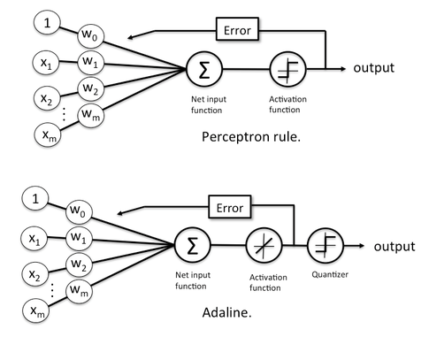

# **Lección 4: Adaline y la Regla de Hebb – Widrow & Hoff (1960)**

## **1. Introducción**

En esta lección exploraremos el modelo **Adaline (Adaptive Linear Neuron)** desarrollado por Bernard Widrow y Marcian Hoff en 1960. También estudiaremos la **Regla de Hebb**, un principio fundamental del aprendizaje en redes neuronales.

El Adaline es un modelo de red neuronal que utiliza una función de activación lineal y se entrena mediante el algoritmo de descenso de gradiente. A diferencia del Perceptrón, que utiliza una función de activación escalón, Adaline permite la regresión lineal y es capaz de aprender patrones más complejos.

El Adaline se basa en la idea de que el aprendizaje se produce al minimizar el error cuadrático medio (MSE) entre la salida deseada y la salida real del modelo. Esto se logra ajustando los pesos de las conexiones neuronales utilizando el algoritmo de descenso de gradiente.

Error cuadrático medio (MSE)

```math
MSE = \frac{1}{n} \sum_{i=1}^{n} (d_i - y_i)^2
```

donde:

- \( n \) es el número de muestras.
- \( d_i \) es la salida deseada (target) para la muestra \( i \).
- \( y_i \) es la salida real del modelo para la muestra \( i \).

Es decir, el MSE mide la diferencia promedio entre las salidas deseadas y las salidas reales del modelo. Un MSE bajo indica que el modelo está haciendo buenas predicciones, mientras que un MSE alto indica que el modelo no está ajustando bien los datos.

## **2. Diferencias entre Perceptrón y Adaline**



Aunque el **Perceptrón** y **Adaline** comparten similitudes, presentan diferencias clave:

| Característica           | Perceptrón              | Adaline                         |
| ------------------------ | ----------------------- | ------------------------------- |
| Función de activación    | Escalón (Step Function) | Lineal (Identity Function)      |
| Algoritmo de aprendizaje | Regla de Perceptrón     | Descenso de Gradiente           |
| Error calculado sobre    | Salida binaria final    | Salida neta antes de activación |
| Aplicaciones             | Clasificación           | Regresión y clasificación       |

En Adaline, la actualización de pesos se basa en el **error antes de aplicar la función de activación**, mientras que en el Perceptrón se actualizan basándose en la **salida final**.

## **3. Corrección del Error y la Regla de Hebb**

La **Regla de Hebb** establece que:

> "Las neuronas que se activan juntas, se fortalecen juntas."

Esto significa que los pesos de una neurona deben ajustarse de manera que las conexiones entre neuronas se refuercen cuando se activan simultáneamente.

En términos matemáticos:

```math
\Delta w_i = \eta \cdot x_i \cdot y
```

Donde:

- \( \Delta w_i \) es el cambio en el peso.
- \( \eta \) es la tasa de aprendizaje.
- \( x_i \) es la entrada.
- \( y \) es la salida de la neurona.

En Adaline, la actualización de pesos sigue la regla de aprendizaje basada en descenso de gradiente:

```math
w_i = w_i + \eta \cdot (d - y) \cdot x_i
```

donde \( y \) es la salida predicha antes de la activación.

## **4. Implementación de Adaline en TensorFlow**

A continuación, se presenta un ejemplo de cómo implementar Adaline en TensorFlow para un problema de regresión simple:

---

**_Keras?_**
En esta lección, utilizaremos la API de Keras dentro de TensorFlow para construir nuestro modelo Adaline.
Keras es una biblioteca de alto nivel que simplifica la creación, entrenamiento y evaluación de modelos de redes neuronales.
**_¿Por qué usamos Keras?_**

Keras proporciona una interfaz intuitiva para definir modelos, lo que permite estructurar fácilmente redes neuronales en TensorFlow sin necesidad de implementar manualmente la propagación hacia adelante y la actualización de pesos.
**_Conceptos clave en Keras usados en este ejemplo_**

```python
tf.keras.Model  # Representa un modelo de red neuronal en Keras.
# En este caso, class Adaline(tf.keras.Model) hereda de tf.keras.Model
# y se utiliza para crear un modelo de red neuronal personalizado.

tf.keras.layers.Dense  # Es una capa densa (fully connected) que se utiliza
# para crear una capa de neuronas en el modelo.

tf.keras.optimizers.SGD  # Es la funcion descenso de gradiente
# que se utiliza para actualizar los pesos del modelo durante el entrenamiento.
```

---

```python
import tensorflow as tf
import numpy as np
import matplotlib.pyplot as plt
from dataset import generate_data

class Adaline(tf.keras.Model):
    def __init__(self, input_dim: int, learning_rate: float = 0.01):
        """Initializes the Adaline model with one linear neuron."""
        super().__init__()
        self.dense = tf.keras.layers.Dense(units=1, activation=None, use_bias=True)
        self.optimizer = tf.keras.optimizers.SGD(learning_rate=learning_rate)

    def call(self, inputs: tf.Tensor) -> tf.Tensor:
        """Performs a forward pass through the Adaline model."""
        return self.dense(inputs)

    def train(self, x_train: np.ndarray, y_train: np.ndarray, epochs: int = 50) -> None:
        """Trains the Adaline model using Mean Squared Error and Gradient Descent."""
        for epoch in range(epochs):
            with tf.GradientTape() as tape:
                predictions: tf.Tensor = self.call(x_train)
                loss: tf.Tensor = tf.reduce_mean(tf.square(y_train - predictions))  # MSE Loss

            gradients = tape.gradient(loss, self.trainable_variables)
            self.optimizer.apply_gradients(zip(gradients, self.trainable_variables))

            if epoch % 10 == 0:
                print(f"Epoch {epoch}, Loss: {loss.numpy():.4f}")

# Load dataset
x_train, y_train = generate_data(num_samples=100)

# Create and train Adaline model
adaline_model = Adaline(input_dim=1, learning_rate=0.01)
adaline_model.train(x_train, y_train, epochs=100)

# Plot results
y_pred = adaline_model.call(x_train).numpy()
plt.scatter(x_train, y_train, label="Actual Data")
plt.plot(x_train, y_pred, color="red", label="Adaline Predictions")
plt.legend()
plt.title("Adaline Regression")
plt.show()
```

un mock dataset se encuentra en el archivo `dataset.py`

```python
import numpy as np

def generate_data(num_samples: int = 100) -> tuple[np.ndarray, np.ndarray]:
    """Generates a synthetic linear dataset for Adaline training."""
    np.random.seed(42)
    x: np.ndarray = np.linspace(-1, 1, num_samples).reshape(-1, 1)
    y: np.ndarray = 2 * x + np.random.normal(scale=0.2, size=x.shape)  # y = 2x + noise
    return x.astype(np.float32), y.astype(np.float32)
```

este código genera un conjunto de datos sintético para entrenar el modelo Adaline. La función `generate_data` crea un conjunto de datos lineales con ruido, donde la relación entre `x` e `y` es aproximadamente lineal.

## **5. Conclusiones**

En esta lección hemos aprendido sobre el modelo Adaline y la regla de Hebb. Adaline es un modelo más avanzado que el Perceptrón, ya que utiliza una función de activación lineal y se entrena mediante descenso de gradiente. La regla de Hebb proporciona una base teórica para entender cómo las neuronas pueden aprender y adaptarse a través de la experiencia.
